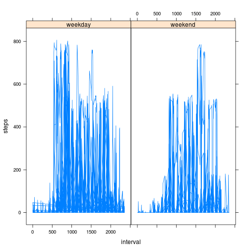

## Loading and preprocessing the data

```r
activity.data <- read.csv("activity.csv")
activity.data$date <- as.Date(activity.data$date)
```

## What is mean total number of steps taken per day?

```r
dataPerDay <- aggregate(activity.data$steps, by=list(activity.data$date),
                        FUN=mean, na.rm=TRUE)
names(dataPerDay) <- c('date', 'mean.steps')
steps.data <- na.omit(dataPerDay$mean.steps)
hist(steps.data)
```

 

```r
options(digits=5)
mean(steps.data)
```

```
## [1] 37.383
```

```r
median(steps.data)
```

```
## [1] 37.378
```


## What is the average daily activity pattern?

```r
aggData <- aggregate(activity.data$steps, by=list(activity.data$interval),
                     FUN=mean, na.rm=TRUE)
names(aggData) <- c("interval","mean.steps")
with(aggData, {
    plot(x=interval, y=mean.steps, type="l")
})
```

 

Computing the interval with the most steps, on average:

```r
aggData[aggData$mean.steps == max(aggData$mean.steps),]
```

```
##     interval mean.steps
## 104      835     206.17
```

## Imputing missing values


Counting the number of NAs in each column:

```r
colSums(is.na(activity.data))
```

```
##    steps     date interval 
##     2304        0        0
```

To impute missing values, we will simply replace missing values with the mean value
for the approriate time interval.


```r
naData <- is.na(activity.data$steps)
imputed.data <- activity.data
avgVals <- aggData[match(imputed.data$interval[naData], aggData$interval),2]
imputed.data$steps[naData] <- avgVals
```

We should now check that there are no longer any missing values:

```r
colSums(is.na(imputed.data))
```

```
##    steps     date interval 
##        0        0        0
```
Summary information for the imputed data:

```r
imputed.dataPerDay <- aggregate(imputed.data$steps, by=list(imputed.data$date),
                        FUN=mean, na.rm=TRUE)
names(imputed.dataPerDay) <- c('date', 'mean.steps')
steps.data <- imputed.dataPerDay$mean.steps
hist(steps.data)
```

 

```r
mean(steps.data)
```

```
## [1] 37.383
```

```r
median(steps.data)
```

```
## [1] 37.383
```

Neither the median nor the mean changed much. We imputed values in the center of the
histogram, so this makes sense. Since we basically assumed that the missing days
resembled that of an average day, the estimate for the total daily number of steps does not change.

## Are there differences in activity patterns between weekdays and weekends?


```r
library(lattice)
daysOfWeek <- weekdays(activity.data$date)
day.type <- ifelse(daysOfWeek %in% c('Saturday', 'Sunday'), 'weekend', 'weekday')
activity.data$day.type <- factor(day.type)
activity.data <- na.omit(activity.data)
with(activity.data, {
    xyplot(steps~interval|day.type, type="l")
})
```

 
